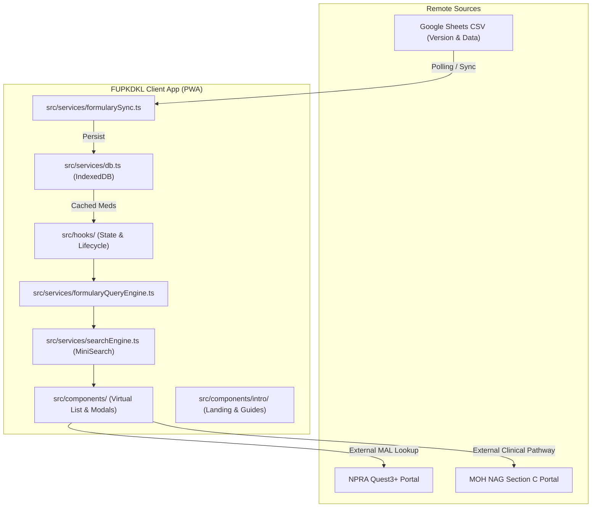

# System Architecture Map & Directory Navigation Index

System boundaries, directory responsibilities, and routing index for **Formulari Ubat PKD Kuala Langat (FUPKDKL)**.

---

## 1. System Context Diagram

---

## 2. Directory Navigation Matrix

Before reading individual implementation files in a directory, read the directory's localized `context.md` catalog:

| Directory Path | Role & Architectural Scope | Local Catalog |
| :--- | :--- | :--- |
| [`src/`](file:///Users/nina/development/projects/fupkdkl/src/) | Root orchestrator, global styling, and app bootstrap | [`src/context.md`](file:///Users/nina/development/projects/fupkdkl/src/context.md) |
| [`src/services/`](file:///Users/nina/development/projects/fupkdkl/src/services/) | Pure domain services (IndexedDB, CSV parser, query engine, MiniSearch, sync) | [`src/services/context.md`](file:///Users/nina/development/projects/fupkdkl/src/services/context.md) |
| [`src/components/`](file:///Users/nina/development/projects/fupkdkl/src/components/) | Main UI components, dialogs, virtual lists, search bar, and onboarding tour | [`src/components/context.md`](file:///Users/nina/development/projects/fupkdkl/src/components/context.md) |
| [`src/components/intro/`](file:///Users/nina/development/projects/fupkdkl/src/components/intro/) | Product documentation, installation guides, and interactive demo landing page | [`src/components/intro/context.md`](file:///Users/nina/development/projects/fupkdkl/src/components/intro/context.md) |
| [`src/hooks/`](file:///Users/nina/development/projects/fupkdkl/src/hooks/) | Custom React hooks (Data synchronization, PWA installation, tour, theming) | [`src/hooks/context.md`](file:///Users/nina/development/projects/fupkdkl/src/hooks/context.md) |
| [`src/types/`](file:///Users/nina/development/projects/fupkdkl/src/types/) | Core TypeScript data models and domain contracts | [`src/types/context.md`](file:///Users/nina/development/projects/fupkdkl/src/types/context.md) |
| [`src/utils/`](file:///Users/nina/development/projects/fupkdkl/src/utils/) | Pure clinical classifiers and text utility functions | [`src/utils/context.md`](file:///Users/nina/development/projects/fupkdkl/src/utils/context.md) |
| [`src/data/`](file:///Users/nina/development/projects/fupkdkl/src/data/) | Static clinical guideline constants (NAG Section C Primary Care pathways) | [`src/data/context.md`](file:///Users/nina/development/projects/fupkdkl/src/data/context.md) |
| [`src/config/`](file:///Users/nina/development/projects/fupkdkl/src/config/) | Static onboarding spotlight tour steps configuration | [`src/config/context.md`](file:///Users/nina/development/projects/fupkdkl/src/config/context.md) |
| [`e2e/`](file:///Users/nina/development/projects/fupkdkl/e2e/) | Playwright end-to-end and accessibility test suites | [`e2e/context.md`](file:///Users/nina/development/projects/fupkdkl/e2e/context.md) |

---

## 3. Global Invariants

1. **Offline-First:** All clinical lookup features must function completely without active internet once seeded.
2. **Pure Service Isolation:** Service modules in `src/services/` and `src/utils/` must remain decoupled from React and UI rendering logic.
3. **WCAG 2.2 Accessibility:** Interactive controls maintain minimum 44px touch targets and high-contrast visible focus rings.
